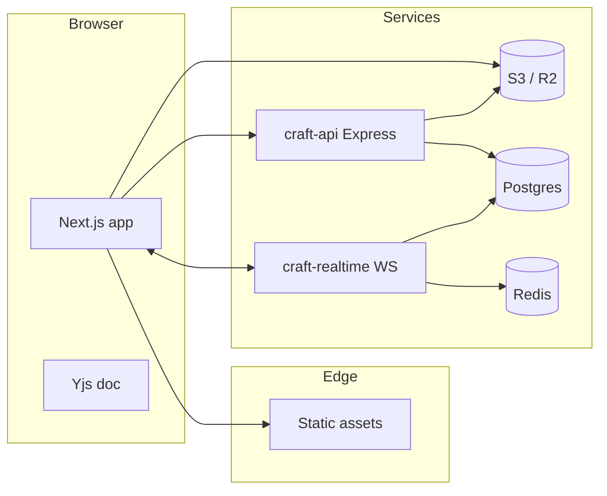

# Paytm Craft — Backend architecture

**Status:** reference — core stack **implemented** (Tracks 4–19); editor remains **local-first** by default.

## Implemented (this repo)

| Component | Package / path | Tracks |
|-----------|----------------|--------|
| REST API | `packages/craft-api` (Express + Prisma) | 4–8, 11–12, 19–23 |
| Realtime sync | `packages/craft-realtime` (Yjs + Postgres) | 4, 7 |
| Mock API | `src/app/api/v1/*` Route Handlers | 2, 24 |
| Client modes | `local` / `api` / `remote` via `paytmCraftEnv` | 2–6 |
| Object storage | MinIO locally; R2/S3 in production | 4, 25 |
| API contracts | `docs/api-contracts.md` + `verify:api-contracts` | 30 |

See [backend-track.md](./backend-track.md), [tracks.md](./tracks.md), and [deployment.md](./deployment.md).

## Target shape (reference)

Auth, multi-tenant workspaces, durable files, versioning, collaboration, and media. Deploy with `npm run stack:up` + `dev:remote` for the full path.

## Goals

- **Identity**: Email/password or SSO (OIDC), sessions or JWT access + refresh, device-aware logout.
- **Tenancy**: Users belong to **teams**; teams own **workspaces**; workspaces contain **projects** and **files** (design documents).
- **Durability**: Canonical document JSON (or Yjs snapshot + updates) in Postgres; large blobs in **S3-compatible** object storage (AWS S3, Cloudflare R2, MinIO).
- **Collaboration**: **Yjs** CRDT on the wire; **Hocuspocus** (or custom Yjs websocket server) for sync; **Redis** for ephemeral presence, typing, and connection metadata.
- **Consistency**: Optimistic UI with server revision; idempotent saves; conflict policy “last writer wins” only where CRDT does not apply (e.g. file rename).

## High-level diagram

## Service responsibilities

| Service | Responsibility |
|--------|----------------|
| **API** (REST/JSON or tRPC) | Auth, workspaces, RBAC, file metadata, versions, comments, signed upload URLs, plugin registry metadata |
| **Realtime** (WebSocket) | Yjs sync: `Y.Doc` per `fileId`, auth on connect, persistence debounce to Postgres |
| **Postgres** | Users, teams, memberships, workspaces, files, revisions, comments, asset metadata |
| **Redis** | Presence keys (`fileId:userId`), rate limits, short-lived locks, pub/sub for cross-region (optional) |
| **Object storage** | Raster/vector exports, uploaded images, generated previews; **not** the primary CRDT log |

## Auth

- **Register/login**: API issues refresh token (httpOnly cookie) + access token (short TTL) or session cookie.
- **Workspace context**: Every mutating request carries `Workspace-Id` (or path segment) checked against membership.
- **Future**: SCIM, SAML for enterprise; API keys for CI exports (scoped).

## Plugins (server-aware)

- **Catalog**: API stores allowlisted plugin IDs, semver, manifest URL (or bundled hash).
- **Execution**: v1 remains **client-side sandbox**; server only records installs and optional audit events.

## Security

- TLS everywhere; WebSocket `wss:`; validate JWT on every realtime message.
- Signed URLs for uploads (time-limited `PUT` to R2).
- Row-level security in Postgres (optional) or strict query scoping in the API layer.

## Related docs

- [database-schema.md](./database-schema.md)
- [realtime-collaboration.md](./realtime-collaboration.md)
- [api-contracts.md](./api-contracts.md)
- [deployment.md](./deployment.md)
